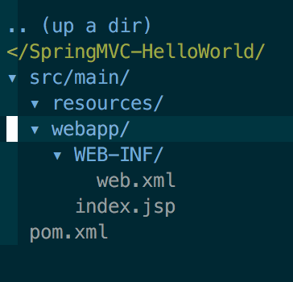

# 使用 Maven 构建 SpringMVC ：Hello World

本文简单介绍如何使用 Maven 框架搭建并配置 StringMVC，完成输入 Hello World 的功能。
<!-- more --><!-- toc -->
看本文前最好了解 Maven 和 Spring 基本知识
## Maven 创建 Web 项目
```bash
mvn archetype:generate -DgroupId=com.wxnacy.spring -DartifactId=SpringMVC-HelloWorld -DarchetypeArtifactId=maven-archetype-webapp -DinteractiveMode=false
```
首先使用上述命令创建一个空的 Web 项目，结构如下



## 创建 Controller 和 View
首先修改 `pom.xml` 文件，添加 SpringMVC 的依赖以及 Tomcat7 的插件
```xml
<project xmlns="http://maven.apache.org/POM/4.0.0" xmlns:xsi="http://www.w3.org/2001/XMLSchema-instance"
  xsi:schemaLocation="http://maven.apache.org/POM/4.0.0 http://maven.apache.org/maven-v4_0_0.xsd">
  <modelVersion>4.0.0</modelVersion>
  <groupId>com.wxnacy.spring</groupId>
  <artifactId>SpringMVC-HelloWorld</artifactId>
  <packaging>war</packaging>
  <version>1.0-SNAPSHOT</version>
  <name>SpringMVC-HelloWorld Maven Webapp</name>
  <url>http://maven.apache.org</url>
  <properties>
    <spring.version>4.0.1.RELEASE</spring.version>
  </properties>

  <dependencies>
    <!-- Spring dependencies -->
    <dependency>
      <groupId>org.springframework</groupId>
      <artifactId>spring-core</artifactId>
      <version>${spring.version}</version>
    </dependency>

    <dependency>
      <groupId>org.springframework</groupId>
      <artifactId>spring-web</artifactId>
      <version>${spring.version}</version>
    </dependency>

    <dependency>
      <groupId>org.springframework</groupId>
      <artifactId>spring-webmvc</artifactId>
      <version>${spring.version}</version>
    </dependency>

    <dependency>
      <groupId>junit</groupId>
      <artifactId>junit</artifactId>
      <version>3.8.1</version>
      <scope>test</scope>
    </dependency>
  </dependencies>
  <build>
    <finalName>SpringMVC-HelloWorld</finalName>
    <plugins>
      <plugin>
        <groupId>org.apache.tomcat.maven</groupId>
        <artifactId>tomcat7-maven-plugin</artifactId>
        <version>2.2</version>
        <configuration>
          <port>8080</port>
          <path>/</path>
          <uriEncoding>UTF-8</uriEncoding>
          <!--<finalName>mgr</finalName>-->
          <server>tomcat7</server>
        </configuration>
      </plugin>

    </plugins>
  </build>
</project>
```
接下来创建 Controller
```bash
$ mkdir -p src/main/java/com/wxnacy/spring/controller
$ touch src/main/java/com/wxnacy/spring/controller/HelloWorldController.java
```
HelloWorldController.java
```java
package com.wxnacy.spring.controller;

import org.springframework.stereotype.Controller;
import org.springframework.web.bind.annotation.RequestMapping;
import org.springframework.web.bind.annotation.RequestMethod;
import org.springframework.web.bind.annotation.RequestParam;
import org.springframework.web.servlet.ModelAndView;


@Controller
public class HelloWorldController {

    @RequestMapping("/hello")
    public ModelAndView helloWorld(
            @RequestParam(value = "name", required = false, defaultValue = "World") String name
            ) {
        ModelAndView mv = new ModelAndView("index");
        mv.addObject("name", name);
        return mv;
    }
}
```
使用注解 `@Controller` 来定义该类为控制器，`@RequestMapping` 映射访问地址 `/hello` 到 `helloWorld` 方法中，该方法接收一个参数，并返回 Model。

最后创建 View
```bash
$ mkdir src/main/webapp/WEB-INF/views
$ touch src/main/webapp/WEB-INF/views/index.jsp
```
index.jsp
```html
<html>
    <body>
        <h2>Hello ${name}!</h2>
    </body>
</html>
```
## 配置 SpringMVC
原料齐全了，接下来需要将他们关联起来，首先在 xml 文件中配置项目启动时扫描的 Controller 和 View 的目录
```bash
$ touch src/main/resources/dispatcher.xml
```
dispatcher.xml
```xml
<?xml version="1.0" encoding="UTF-8"?>
<beans xmlns="http://www.springframework.org/schema/beans"
       xmlns:xsi="http://www.w3.org/2001/XMLSchema-instance"
       xmlns:context="http://www.springframework.org/schema/context"
       xsi:schemaLocation="http://www.springframework.org/schema/beans
    http://www.springframework.org/schema/beans/spring-beans-3.0.xsd
    http://www.springframework.org/schema/context
    http://www.springframework.org/schema/context/spring-context-3.2.xsd">


    <context:component-scan base-package="com.wxnacy.spring.controller"/>

    <bean
            class="org.springframework.web.servlet.view.InternalResourceViewResolver">
        <property name="prefix">
            <value>/WEB-INF/views/</value>
        </property>
        <property name="suffix">
            <value>.jsp</value>
        </property>
    </bean>
</beans>
```
然后在 web.xml 中设置 Servlet，用 `/` 地址映射刚才的配置文件。
```xml
<?xml version="1.0" encoding="UTF-8"?>
<web-app xmlns="http://java.sun.com/xml/ns/javaee"
         xmlns:xsi="http://www.w3.org/2001/XMLSchema-instance"
         xsi:schemaLocation="http://java.sun.com/xml/ns/javaee
                      http://java.sun.com/xml/ns/javaee/web-app_3_0.xsd"
         version="3.0">
  <servlet>
    <servlet-name>dispatcher</servlet-name>
    <servlet-class>org.springframework.web.servlet.DispatcherServlet</servlet-class>
    <init-param>
      <param-name>contextConfigLocation</param-name>
      <param-value>classpath:dispatcher.xml</param-value>
    </init-param>
    <load-on-startup>1</load-on-startup>
  </servlet>
  <servlet-mapping>
    <servlet-name>dispatcher</servlet-name>
    <url-pattern>/</url-pattern>
  </servlet-mapping>

  <display-name>Archetype Created Web Application</display-name>
</web-app>
```
此时项目目录结构为


启动项目
```bash
$ mvn tomcat7:run
```
此时访问地址 `http://localhost:8080/hello` 出现如下效果即为成功


更多文章：https://wxnacy.com/
